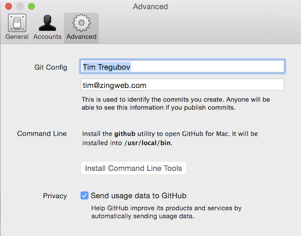

# WEBDEV getting started


So you want to make a webpage. You want your own domain.  You want it all.  This is a 1 hour long tutorial to get you up and running and developing with some nice tools.  This mostly assumes that you are using a recent version of OS X, so your mileage may vary.


##1)  Tools

* [atom.io](http://atom.io) 
  
  is a great code editor, it is cross platform and looks pretty.

* [git](http://git-scm.com)  
  git is a code collaboration tool but also will allow us to use github to host our pages! If you already have git then you can skip this step.
  1.  Got to [github.com](http://github.com) and create an account if you don't have one already. 
  1.  Install the github app from here: [Mac](http://mac.github.com) or [PC](http://windows.github.com).
  1.  Run GitHub app, and set up with your new account.
  1.  Go to Preferences -> Advanced and fill in your information with the same email you used for your github account and then click "Install Command Line Tools"
  

* no other tools will be necessary but for the future here's a recommended [list of DALI recommended dev tools](https://docs.google.com/document/d/1XODTyblh3NP1sxO-mObPfx5STlbD78tK0r2lmj4E8Co).

##2)  Terminal

We'll have to use some Terminal command line dark magic here.  Copy/paste is your friend.  

1. Open Terminal (on Windows open Git Shell)
1. ```cd ~/Desktop```
2. ```git clone https://github.com/timofei7/all-the-webdev.git```

what this does is change directory to your Desktop and then clones the the tutorial repository there.

 