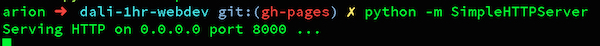
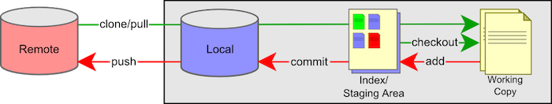

# DALI Project Collaborative Intro WEBTIVITY


## Overview 

*  In your groups, each person will use git to clone a version of a new landing page template project for your team.  
*  Then you'll edit some html and css to make this template page reflect what your project is about.
*  Each person should add themselves into the team section
*  Then you'll commit and merge your changes of the page with your teammates and push your changes to the git repo.

  This mostly assumes that you are using a recent version of OS X, so your mileage may vary. Some of the template is broken in Firefox -- for now don't use firefox. 

 indicates a step to do. 


##1)  Tools

* ###[atom.io](http://atom.io)

  is a great code editor, it is cross platform and looks pretty.
  <br> 1.0)  install from [atom.io](http://atom.io)
  <br> 1.1)  open Atom and then do: *Atom -> Install Shell Commands*

* ###[git+github](http://www.github.com)  al
  git is a code collaboration tool but also will allow us to use github to host our pages! If you already have git then you can skip this step.
  
  <br> 1.2)  Go to [github.com](http://github.com) and create an account if you don't have one already!
  <br> 1.3)  Install the github app from here: [Mac](http://mac.github.com) or [PC](http://windows.github.com).
  <br> 1.4)  Run *GitHub* app, and set up with your new account.
  <br> 1.5)  Go to *Preferences* -> *Advanced* and fill in your information with the same email you used for your github account and then click *Install Command Line Tools*
  

* no other tools will be necessary but for the future here's a recommended [list of DALI recommended dev tools](https://docs.google.com/document/d/1XODTyblh3NP1sxO-mObPfx5STlbD78tK0r2lmj4E8Co).

##2)  Terminal

We'll have to use some Terminal command line dark magic here.  Copy/paste is your friend.  

  <br> 2.0)  Open Terminal (on Windows open Git Shell)
  <br> 2.1)  ```cd ~/Desktop```
  <br> 2.2)  ```git clone https://github.com/dali-lab/project-name.git```
  <br> 2.3)  ```cd dali-1hr-webdev```

what this does is change directory to your Desktop, then clones the the tutorial repository there, and then you cd into that cloned repository.  For the rest of this tutorial we assume that you have a Terminal window open and that you are cd'd into the repository you just cloned.  If you get any errors in the above give a shout! 

Some more Terminal commands that are useful:

```ls -la```  will list files in current directory </br>
```pwd```  will show current directory</br>
```cd  somenewdirectory```  will change directory to *somenewdirectory*</br>
```cp source target``` will copy files</br>
```mv source target``` will move</br>


You are now ready to start webdev for real!


##3) Code

  <br> 3.0)  In Terminal run:  ```atom .```

This will open the current folder into the Atom text editor. Note the folder structure.  What are you reading now (in browser) is actually a [markdown](https://guides.github.com/features/mastering-markdown/) file: **README.md**. 

The main file that gets loaded for the site is **index.html**.
The file that contains the majority of css styling is in **css/main.css**.
Image assets are in **img**.
Javascripts are in **js**.

  <br> 3.1) Lets view what is there already now. In Terminal (copy/paste):  ```python -m SimpleHTTPServer &``` 

<br>
this will start a simple little webserver so you can now access the page in your browser at: [http://localhost:8000](http://localhost:8000)

*If you get an error or don't have python, never fear, for now just open **index.html** manually in your browser, this breaks for certain javascript but will work for this example.*
  
  <br> 3.2) back in Atom, 

Play around and make some changes.  In particular add yourself to the team section!  Change some images.  We'll walk through this step but in particular see if you can find *(command+f)* teammates and see how to change the text and image.  To insert a new image just put a .jpg or .png in the img folder (make sure it is square) and change the ```img src=``` line. 


##4) Git


Now that you've made some changes to the site, we'll go over how to use git to commit and push your changes.   Git is a code version control system and allows you to have a named log of your changes to the code and a way to work on the same files together with other people. It is sort of like an offline google docs where you *commit* every set of changes. [Here's a good resource](http://rogerdudler.github.io/git-guide/) but we'll do the basics here.  



###Clone the repo:
You have already done this step using the ```git clone``` command.


###Commit your changes:
In Terminal:  ```git commit -am "i made some changes"```

``-a`` means all changes<br>
``-m`` indicates that your commit message follows directly, a commit message is required.


###Pull your teammates changes:
In Terminal:  ```git pull```

This will check the github remote server for any changes and download and merge them into your local repo. 

###Merge Conflicts

At this point after a ```git pull``` you may get a message that looks like this:

     CONFLICT (content): Merge conflict in somefile
     Automatic merge failed; fix conflicts and then commit the result.

This is when the fun starts.  How do you fix this?

The cause for merge conflicts is when you edited the exact same line as someone else and git doesn't know how to automatically merge that. So to fix you just need to pick apart the conflict and merge it in.

If you were to do this by hand, git takes the pretty code you wrote and injects terrible "conflict markers" that look like this:

	<<<<<<< HEAD
	var h = 'hello, world';
	=======
	var h = 'Hi!';
	>>>>>>> cb1abc6bd98cfc84317f8aa95a7662815417802d
      
where the line between  ```<<<HEAD``` and ```====``` is the line/lines of code that are relevant in your file, and between  ```====``` and ```>>>> cb1abc6``` are from the remote repository.  The crazy characters refer to the commit that the change comes from. 

Since we've been using Atom so far there is a nice plugin to help visualize this a little better.

  <br> Atom -> Preferences -> Install -> search for merge-conflicts
  


Once you have your conflict file the way you want it.  Fixed and without any more of the conflict markers.

All you have to do to continue is:  ```git add thefixedfile``` which indicated to git that you have resolved the conflict. Then ```git commit``` with no options will complete the merge and automatically create a commit message.


###Push Your Commits

Now that you've resolved any conflicts you're ready to push to the remote repository!

  <br> ```git push origin gh-pages```
  
  ```origin``` is the remote you are pushing to and is named origin by default
 
 ```gh-pages``` is the branch you are pushing. Using the ```gh-pages``` branch lets github know that you would like this code hosted as a static website.

###Done!

Now you can go to [http://dali-lab.github.io/project-name](http://dali-lab.github.io/project-name) to see your site!


<br>

To stop the python web server process just run:
```pgrep -f SimpleHTTPServer| xargs kill```

